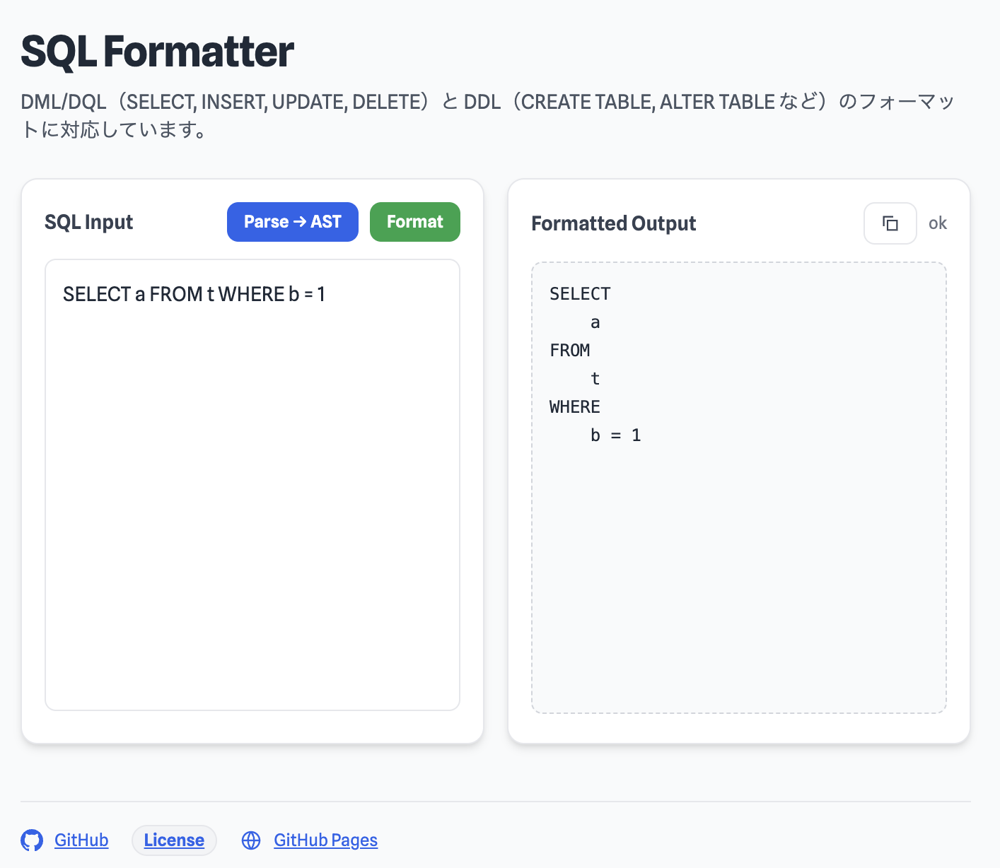

# SQL Formatter (WIP)

このリポジトリは、**SQL Formatter** を作るためのプロジェクトです。
現在は **SQL パーサー** に加えて、**フォーマッターの実装も進行中**です。



## 目的
- 最終目標: SQL を整形するフォーマッタの実装
- 現状: SQL パーサー + フォーマッターの両方を実装中

## 現在の構成
- `spec/apache-calcite-Parser.js`: パーサー本体（lexer + parser）
- `spec/apache-calcite-Parser-test.js`: 回帰/異常系テスト
- `spec/apache-calcite-Parser.md`: 仕様（EBNFベース）
- `spec/wellknown-sql-ddl.md`: DDL 仕様（EBNFベース、ANSI SQL 風。元仕様が異なるため `apache-calcite-Parser.md` と統合しない）
- `spec/apache-calcite-Parser.jj`: 参照文法
- `AST.md`: AST 仕様（暫定）
- `FORMATTER_RULES.md`: SQL Formatter の出力ルール
- `index-parser.html`: SQL → AST 出力の簡易デモ
- `index.html`: SQL Formatter の UI
- `sql-formatter.js`: SQL フォーマッター本体
- `sql-formatter-test.js`: フォーマッターテスト

## 使い方（開発時）
テストを実行してパーサーの動作確認ができます。

### 実行コマンド
```bash
node spec/apache-calcite-Parser-test.js
node sql-formatter-test.js
```

### テスト実行ポリシー
- 生成AIが変更を加えた場合、まず生成AI側でテスト実行する
- 例外がある場合は、その理由を明記する

### テスト記述の指針
- 仕様が確定しているケースは `expect` 固定が有利（消失や回帰を確実に検知できる）
- `expectIncludes` は変動余地のあるケースや部分的な確認に限定する

### 開発時の基本方針
- `.md` と `.js` の production 名は一致させる
- パーサー変更時は `node spec/apache-calcite-Parser-test.js` を実行
- フォーマッター変更時は `node sql-formatter-test.js` も実行
- 破壊的変更は `TODO.md` に記録

## 直近の作業予定

### 完了した項目
- **index-parser.html**: SQL → AST を出力する簡易デモ（実装済み）
- **DDL フォーマッター統合**: CREATE/ALTER/DROP TABLE, CREATE INDEX など（実装済み）
  - 6 つの DDL レンダラー関数を実装
  - 12 個の DDL テストケースを追加
  - 全 117 テスト合格（105 既存 DML + 12 新規 DDL）

### 進行中の項目
- **index.html**: SQL Formatter の UI（実装中）
- フォーマッターの対応範囲拡張（UNION, WINDOW FUNCTIONS など）
- AST 仕様の整理と固定化
- 構文の厳密化（句の順序/排他の追加チェック）

## 仕様情報の流れ（開発過程）
- `spec/apache-calcite-Parser.jj` の文法を元に `spec/apache-calcite-Parser.md`（EBNF仕様）を作成
- `spec/apache-calcite-Parser.md` を元に `spec/apache-calcite-Parser.js`（実装）を生成

## 生成AI向けの開発ガイド

### アーキテクチャ概要
このプロジェクトは 2 段階のパーサーフォールバック戦略を採用しています：

1. **第1段階**: Apache Calcite パーサー（DML/DQL 最適化）
   - `sql-formatter.js` の `formatSql()` 関数で使用
   - SELECT, INSERT, UPDATE, DELETE 文を処理

2. **第2段階**: DDL 専用パーサー（DDL 文対応）
   - Calcite が失敗した場合のフォールバック
   - CREATE/ALTER/DROP TABLE, CREATE INDEX, CREATE VIEW など
   - `spec/wellknown-sql-ddl.js` から WellknownDdlLexer/Parser を使用

3. **第3段階**: パススルー
   - 両方のパーサーが失敗した場合は元の SQL を返す

### フォーマッティングスタイル
```
- インデント: 4 スペース
- キーワード: 大文字（UPPERCASE）
- カンマ位置: リスト先頭（comma-first style）
- 主要句改行: FROM, JOIN, WHERE, GROUP BY, HAVING, ORDER BY は必ず改行
```

### プレースホルダー対応
- 対応: `?`, `:name`, `@name`
- `:name` / `@name` の名前は `^[A-Za-z_][A-Za-z0-9_]*$` のみ許可
- `schema:table` など、識別子直後の `:name` はプレースホルダー扱いしない
- `$1` は識別子優先。LIMIT/OFFSET/FETCH ではプレースホルダーとして扱う
- PostgreSQL の `?` 系演算子（jsonb など）は非対応（`?` は常にプレースホルダー）

### DDL 統合（2026年1月実装）
**コミット**: `f91ec95` "Integrate DDL parser for table and index formatting"

**実装内容**:
- DDL パーサーのインポート追加
- `formatSql()` に DDL フォールバック機能追加
- 6 つの DDL レンダラー関数実装
  - `renderDropTable()`: DROP TABLE [IF EXISTS] [CASCADE/RESTRICT]
  - `renderCreateTable()`: CREATE [TEMPORARY] TABLE with column definitions/AS/LIKE
  - `renderCreateIndex()`: CREATE [UNIQUE] INDEX with column lists
  - `renderAlterTable()`: ALTER TABLE with flexible action capture
  - `renderTruncateTable()`: TRUNCATE TABLE
  - `renderCreateView()`: CREATE [OR REPLACE] VIEW with columns/AS
- CompoundIdentifier ハンドラーを拡張（文字列と Identifier オブジェクト両対応）
- 12 個の DDL テストケース追加

**テスト結果**: 117/117 テスト合格（リグレッションなし）

### 次のステップ（生成AI向け）
次の機能拡張を検討する際は以下を参考にしてください：

1. **UNION/INTERSECT/EXCEPT サポート**
   - 現在: パススルー（フォーマット未実装）
   - 実装方針: 既存パーサーを拡張するか、DDL パーサーを活用

2. **WINDOW FUNCTIONS サポート**
   - 現在: パススルー
   - 実装方針: renderNode() に OVER/PARTITION BY ハンドラー追加

3. **CTE (WITH) サポート**
   - 現在: パススルー
   - 実装方針: Calcite パーサー拡張 or カスタムハンドラー追加

4. **CASE 式のフォーマット**
   - 現在: パススルー（未実装）
   - 実装方針: renderNode() に CASE ハンドラー追加

### テストの追加方法
`sql-formatter-test.js` に以下の形式で新しいテストグループを追加：

```javascript
const newFeatureTests = [
  {
    name: 'test-id',
    category: 'category-name',
    description: 'Test description',
    sql: 'SELECT ...',
    expect: `formatted output`,  // または expectIncludes: ['keyword1', 'keyword2']
  },
];

// allTestGroups 配列に登録
const allTestGroups = [
  // ... existing groups ...
  { name: 'Feature Name', tests: newFeatureTests },
];
```

### 重要な実装パターン
- `renderNode(node, ctx)`: 全ての AST ノード型の統一入口
- `ctx` オブジェクト: インデントレベルと状態管理
- `indent(ctx, extra)`: インデント生成ヘルパー
- `markUnknown(ctx)`: 未実装ノード型のマーク

### Pull Request 作成時の注意事項
**`gh` コマンドで自動的に PR を作成しないでください。**

PR 作成する場合は、以下のいずれかの方法を使用してください：

1. **GitHub Web UI での手動作成（推奨）**
   - 提供される PR テンプレートテキストをコピー
   - GitHub Web にブラウザでアクセス
   - "New Pull Request" ボタンで新規 PR を作成
   - テンプレートテキストを PR Description に貼付

2. **ローカルでの branch / commit 作成のみ実施**
   - 機能実装と commit までを完了
   - PR テンプレートを生成
   - 実際の PR 作成はユーザーが GitHub Web UI で実施

**理由**: ユーザーの CI/CD パイプライン、approval flow、branch protection など、リポジトリ固有の PR プロセスに合わせる必要があるため、自動 PR 作成ではなく手動作成が前提です。

## デモ機能
- AST の JSON 出力
- トークン一覧の表示
- エラートークンのハイライト表示

## ライセンス
`LICENSE` を参照してください。
